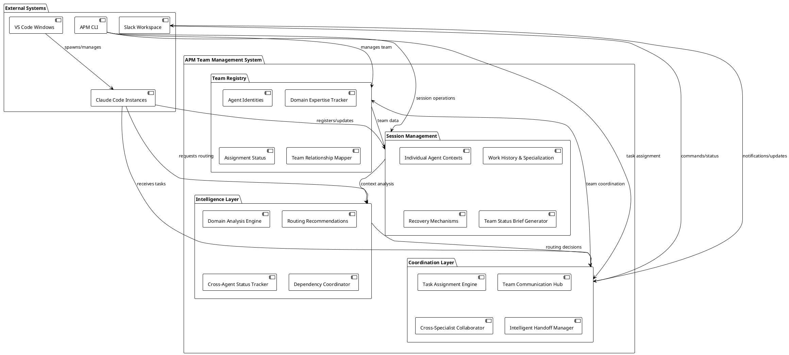
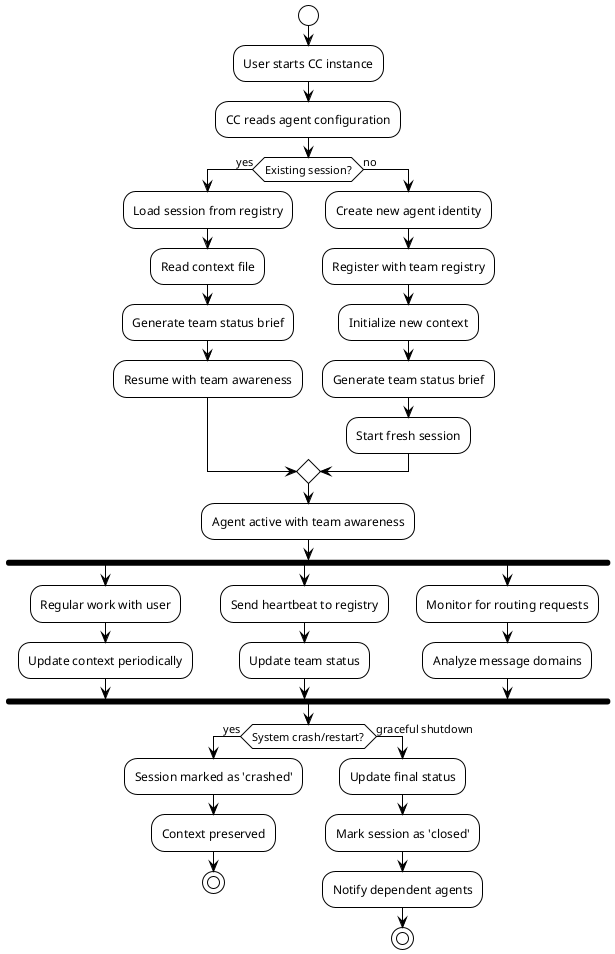
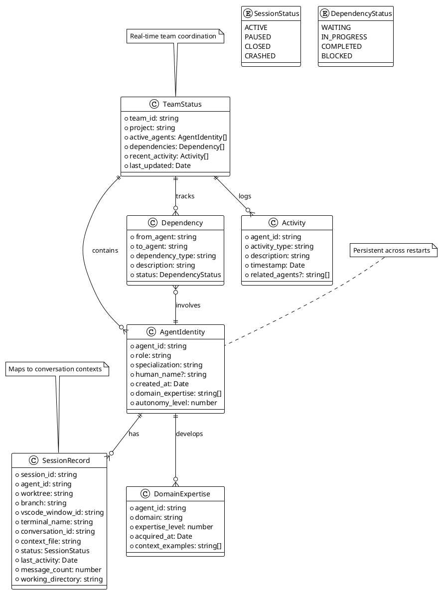
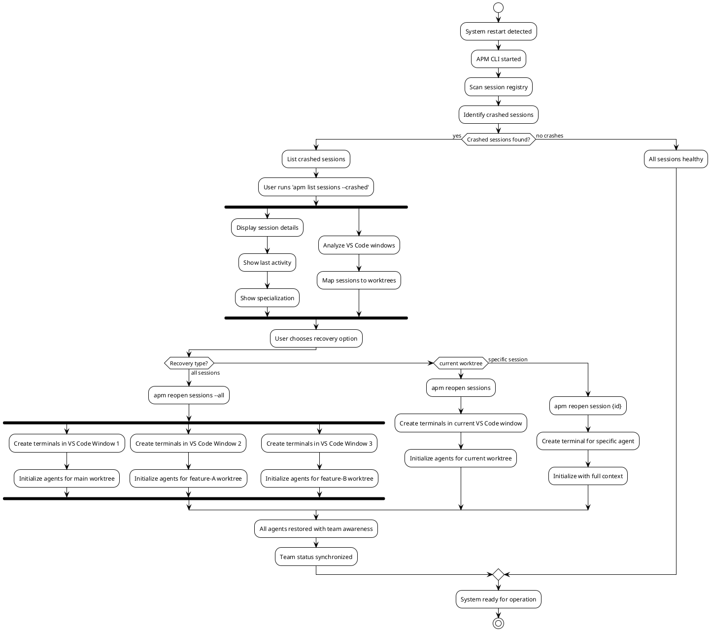

# APM System Architecture UML Diagrams

## System Architecture Diagram



## Agent Lifecycle Diagram



## Team Coordination Sequence Diagram

```plantuml
@startuml Team_Coordination_Sequence
!theme plain

actor User
participant "dev-sarah-auth" as Sarah
participant "Team Registry" as Registry
participant "Intelligence Layer" as Intel
participant "dev-mike-ui" as Mike

User -> Sarah : "How do I style the dashboard buttons?"

Sarah -> Intel : analyze_message_domain("style dashboard buttons")
Intel -> Intel : domain = "ui-styling"
Intel -> Sarah : domain_mismatch(confidence=0.9, suggested="dev-mike-ui")

Sarah -> Registry : get_agent_status("dev-mike-ui")
Registry -> Sarah : {active: true, current_task: "dashboard components", terminal: "tab-3"}

Sarah -> User : """
🤔 I notice you're asking about dashboard styling, 
but I specialize in authentication systems.

You should talk to **dev-mike-ui** who's working on 
dashboard components (currently active in terminal tab 3).

Would you like me to help coordinate with him?
"""

User -> Sarah : "Yes, please coordinate"

Sarah -> Mike : coordinate_handoff(user_request="dashboard button styling")
Mike -> Sarah : acknowledge_handoff()

Sarah -> User : "I've notified dev-mike-ui. You can find him in terminal tab 3, or he may message you shortly."

note right of Sarah
  Sarah maintains context that 
  auth-related aspects of dashboard 
  styling should come back to her
end note

@enduml
```

## Data Model Diagram



## Slack Integration Architecture

```plantuml
@startuml Slack_Integration_Architecture
!theme plain

package "Slack Workspace" {
  component "#apm-command-center" as CMD
  component "#apm-agents-activity" as ACTIVITY
  component "#proj-{name}-dashboard" as PROJ
}

package "APM Coordination System" {
  component "Slack Command Processor" as SCP
  component "Webhook Server" as WHS
  component "Task Assignment Engine" as TAE
  component "Team Status Reporter" as TSR
}

package "Agent Network" {
  component "dev-sarah-auth" as SARAH
  component "dev-mike-ui" as MIKE
  component "pe-jennifer-ux" as JENNIFER
  component "..." as MORE
}

' Slack -> APM flow
CMD -> SCP : /apm-assign, /apm-status
SCP -> TAE : parse and route commands
TAE -> SARAH : assign specific task
TAE -> MIKE : assign specific task

' APM -> Slack flow  
SARAH -> WHS : status updates
MIKE -> WHS : task completion
WHS -> ACTIVITY : post team updates
TSR -> PROJ : project status

' Cross-agent coordination
SARAH <-> MIKE : dependency coordination
JENNIFER -> TSR : expertise insights

note right of SCP
  Processes commands like:
  /apm-assign @dev-sarah-auth "fix OAuth bug"
  /apm-status team
  /apm-handoff sarah -> mike
end note

@enduml
```



## Recovery Process Flow



These diagrams illustrate the complete architecture for the APM persistent team management system, showing how agents maintain individual identity while coordinating as a team with intelligent routing and recovery capabilities.